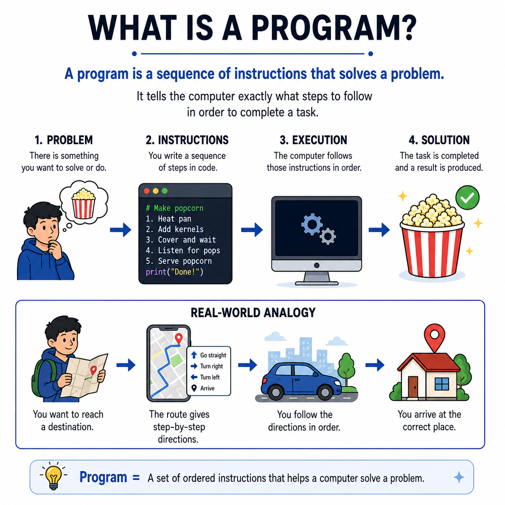

# 🌟 Programming Concepts Visualized

## Level 1: Programming Foundations
### 🔍 Module 2: What is a Program?

> **One concept. One visual. One clear explanation at a time.**

---



---

## 💡 What is a Program?

A **program** is a sequence of instructions that solves a problem. It tells the computer exactly what steps to follow, and in what order, to complete a specific task.

If *programming* is the act of writing the recipe, then the *program* is the completed **recipe book** itself, waiting to be followed.

---

## 🍿 The Popcorn Example

To understand how a program functions, look at the simple task of making popcorn:

1.  **1. PROBLEM:** There is something you want to solve or do (e.g., you are hungry and want popcorn 🍿).
2.  **2. INSTRUCTIONS:** You write down the exact sequence of steps required to make it:
    ```python
    # Make popcorn
    1. Heat pan
    2. Add kernels
    3. Cover and wait
    4. Listen for pops
    5. Serve popcorn
    print("Done!")
    ```
3.  **3. EXECUTION:** The computer (or cook) processes and executes those instructions in order.
4.  **4. SOLUTION:** The task is successfully completed, producing the desired result (a delicious bucket of popcorn! ✅).

---

## 📍 Real-World Analogy: GPS Route Navigation

Think of a program like a **GPS Navigation System**:

*   **The Problem:** You want to reach a specific destination.
*   **The Program (Route):** The GPS generates a set of step-by-step directions (`Go straight` ➔ `Turn right` ➔ `Turn left` ➔ `Arrive`).
*   **The Execution:** You drive the car, following each navigation prompt in the exact order given.
*   **The Output:** You arrive safely at the correct destination.

---

## 📊 Analogy Comparison Table

| Phase | 🍿 Popcorn Analogy | 📍 GPS Navigation Analogy | 💻 Computer Program Equivalent |
| :--- | :--- | :--- | :--- |
| **1. The Problem** | Hungry for popcorn | Need to find your way to a destination | A user wants to solve a task or calculate a value |
| **2. The Instructions** | The popcorn recipe steps | The step-by-step driving directions | **The Code (The Program)** |
| **3. The Execution** | Heating the pan, waiting, and serving | Driving the vehicle following the prompts | **The CPU/Processor executing the instructions** |
| **4. The Solution** | A bucket of fresh popcorn | Arriving at the destination | **The Output / Final Result** |

---

## 🎯 Key Takeaway

> [!TIP]
> **Program = A set of ordered instructions that helps a computer solve a problem.**
> 
> **Order matters!** If you try to serve the popcorn before adding the kernels or heating the pan, the program fails. Computers execute instructions exactly as they are written, from top to bottom.

---

### 🏷️ Series Tags
`#Programming` `#Coding` `#LearnToCode` `#ProgrammingEducation` `#ComputerScience` `#SoftwareDevelopment` `#TeachingProgramming` `#CodingForBeginners` `#ProgrammingConcepts` `#Education`

## 📢 Stay Updated

Be sure to ⭐ this repository to stay updated with new examples and enhancements!

## 📄 License

⚖️ This repository uses a hybrid licensing model to protect its custom educational visuals:

*   **Explanations & Code:** Licensed under the permissive [MIT License](https://mit-license.org/).
*   **Visual Assets & Diagrams:** Copyright © [Panagiotis Moschos](https://www.linkedin.com/in/panagiotis-moschos). **All Rights Reserved.** Any reproduction, modification, redistribution, or commercial use of the images, illustrations, or diagrams in this repository requires explicit written permission.

## Contact 📧
Panagiotis Moschos - pan.moschos86@gmail.com

---
<h1 align=center>Happy Coding 👨‍💻 </h1>

<p align="center">
  Made with ❤️ by 
  <a href="https://www.linkedin.com/in/panagiotis-moschos" target="_blank">
  Panagiotis Moschos</a>
</p>