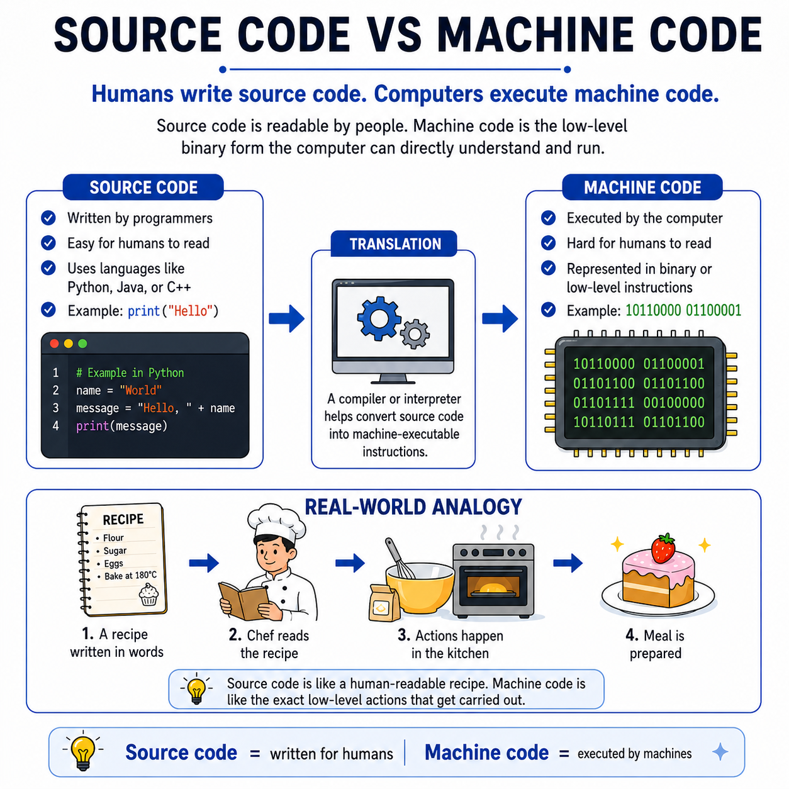

# 🌟 Programming Concepts Visualized

## Level 1: Programming Foundations
### 🔍 Module 3: Source Code vs Machine Code

> **One concept. One visual. One clear explanation at a time.**

---

---

## 💡 Humans vs. Computers

Source code vs. machine code can sound confusing at first, but the core idea is actually very simple:

*   **Humans write source code.**
*   **Computers execute machine code.**

*   **Source Code:** The version of a program that programmers can read and write using languages like Python, Java, or C++.
*   **Machine Code:** The low-level binary form (made of 0s and 1s) that the computer can directly understand and run.

---

## ⚙️ The Translation Process

For a program to run, the computer needs to convert human instructions into machine actions. The fundamental flow looks like this:

1.  **WRITE SOURCE CODE ✍️:** A programmer writes instructions in a high-level language.
2.  **TRANSLATION 🔄:** A compiler or interpreter converts the source code into binary.
3.  **MACHINE EXECUTION 💻:** The computer executes the machine-level instructions.
4.  **RESULT PRODUCTION 🎯:** The program runs and produces a final result.

---

## 🍳 Real-World Analogy: The Kitchen Recipe

Think of programming in a very similar way to cooking a meal from a recipe:

*   **The Recipe (Source Code):** Written in human words so that a person can easily read and understand it.
*   **The Cooking Actions (Machine Code):** The exact low-level physical actions (chopping, stirring, heating) carried out in the kitchen to make the meal happen.
*   **The Chef (Compiler/Interpreter):** The translator who reads the human-readable recipe and carries out (or translates it into) the physical actions.
*   **The Meal (Result):** The final prepared dish.

---

## 📊 Comparison: Source Code vs. Machine Code

| Feature | ✍️ Source Code | 🔢 Machine Code |
| :--- | :--- | :--- |
| **Written For** | Humans (Programmers) | Computers (CPUs) |
| **Readability** | High-level (easy to read and write) | Low-level (binary `0`s and `1`s, hard for humans to read) |
| **Languages** | Python, Java, C++, JavaScript, etc. | Binary instructions (machine language) |
| **Execution** | Cannot be executed directly by computers | Executed directly by the computer hardware |
| **Analogy Equivalent** | The human-readable recipe | The physical actions carried out in the kitchen |

---

## 🎯 Key Takeaway

> [!TIP]
> **Source code is written for humans. Machine code is executed by the computer.**
> 
> The compiler or interpreter bridges the gap by translating human-readable instructions into the binary language that computer hardware understands. Once students grasp this connection, many advanced programming concepts become much clearer.

---

### 🏷️ Series Tags
`#Programming` `#Coding` `#LearnToCode` `#ProgrammingEducation` `#ComputerScience` `#SoftwareDevelopment` `#TeachingProgramming` `#CodingForBeginners` `#ProgrammingConcepts` `#SourceCode` `#MachineCode` `#Education`

## 📢 Stay Updated

Be sure to ⭐ this repository to stay updated with new examples and enhancements!

## 📄 License

⚖️ This repository uses a hybrid licensing model to protect its custom educational visuals:

*   **Explanations & Code:** Licensed under the permissive [MIT License](https://mit-license.org/).
*   **Visual Assets & Diagrams:** Copyright © [Panagiotis Moschos](https://www.linkedin.com/in/panagiotis-moschos). **All Rights Reserved.** Any reproduction, modification, redistribution, or commercial use of the images, illustrations, or diagrams in this repository requires explicit written permission.

## Contact 📧
Panagiotis Moschos - pan.moschos86@gmail.com

---
<h1 align=center>Happy Coding 👨‍💻 </h1>

  Made with ❤️ by 
  <a href="https://www.linkedin.com/in/panagiotis-moschos" target="_blank">
  Panagiotis Moschos</a>

