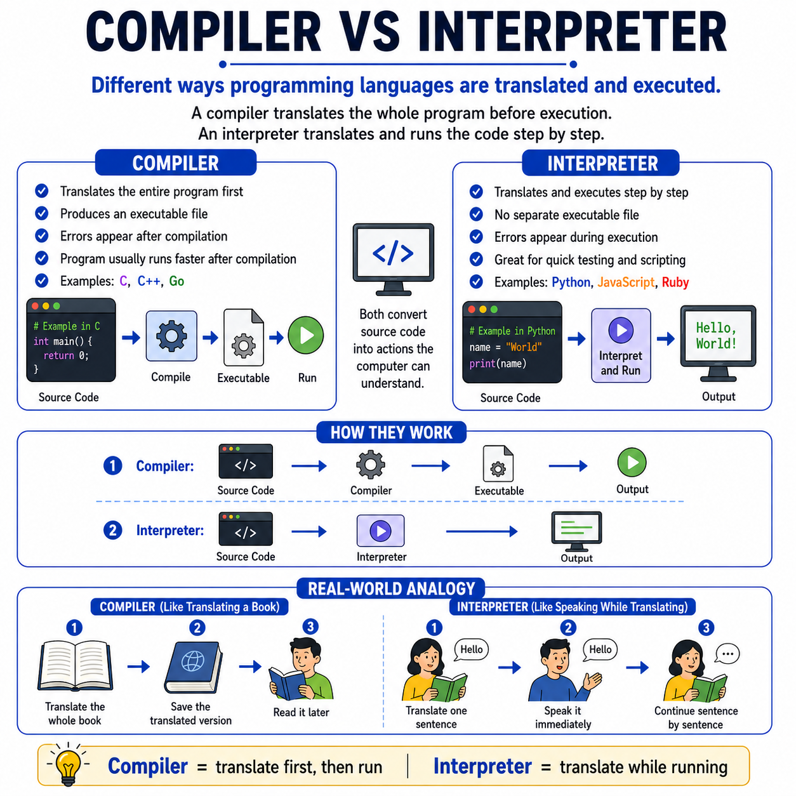

# 🌟 Programming Concepts Visualized

## Level 1: Programming Foundations
### 🔍 Module 4: Compiler vs Interpreter

> **One concept. One visual. One clear explanation at a time.**

---

---

## 💡 The Core Distinction

Compiler vs interpreter can sound like a technical detail at first, but the main idea is actually simple:

Both help convert source code into something the computer can execute. The difference is how they do it.

*   **Compiler:** Translates the entire program first, before running it.
*   **Interpreter:** Translates and executes the code step by step.

So the core distinction is this:

> [!NOTE]
> **Compiler = Translate first, then run**
>
> **Interpreter = Translate while running**
>
> That is the key mental model.

*   A **compiler** usually produces an executable file. This means the program is translated ahead of time, and then it can be run later.
*   An **interpreter** usually works line by line or step by step. This is why it is often very useful for scripting, quick testing, and interactive programming.

---

## ⚙️ The Translation & Execution Process

When teaching beginners, it is important not only to explain definitions, but also to show the process clearly:

1.  **Source Code ✍️:** Written by the programmer.
2.  **Translation 🔄:** A compiler or interpreter handles the translation.
3.  **Execution 💻:** The computer executes the result.
4.  **Output 🎯:** The final output is produced.

---

## 🍳 Real-World Analogy: Language Translation

Think of it like translating a human language:

*   **The Compiler (Book Translation):** Think of a compiler like translating an entire book first. Once the full translation is ready, someone can read it whenever they want.
*   **The Interpreter (Live Translation):** Think of an interpreter like translating a speaker sentence by sentence while they are talking. The translation happens in real time, as the conversation continues.

---

## 📊 Comparison: Compiler vs. Interpreter

| Feature | ⚙️ Compiler | 🔄 Interpreter |
| :--- | :--- | :--- |
| **Translation Timing** | Translates the entire program first, before running | Translates and executes step-by-step (line-by-line) during run |
| **Output File** | Usually produces an executable file (e.g., `.exe`) | Does not produce an executable file; runs code on the fly |
| **Execution Speed** | Faster execution (already compiled ahead of time) | Slower execution (must be translated while running) |
| **Best Used For** | Large applications, production, performance-critical tasks | Scripting, rapid testing, and interactive programming |
| **Common Languages** | C, C++, Rust, Go | Python, JavaScript, Ruby |
| **Analogy Equivalent** | Translating an entire book before anyone reads it | Translating a speaker sentence-by-sentence in real time |

---

## 🎯 Key Takeaway

> [!TIP]
> **Compiler = Translate First, Run Later | Interpreter = Translate & Run on the Fly**
> 
> Once students understand this difference, they can much more easily understand why languages like C and C++ are often associated with compilation, while languages like Python and JavaScript are commonly associated with interpretation.

---

### 🏷️ Series Tags
`#Programming` `#Coding` `#LearnToCode` `#ProgrammingEducation` `#ComputerScience` `#SoftwareDevelopment` `#TeachingProgramming` `#CodingForBeginners` `#ProgrammingConcepts` `#Compiler` `#Interpreter` `#Education`

## 📢 Stay Updated

Be sure to ⭐ this repository to stay updated with new examples and enhancements!

## 📄 License

⚖️ This repository uses a hybrid licensing model to protect its custom educational visuals:

*   **Explanations & Code:** Licensed under the permissive [MIT License](https://mit-license.org/).
*   **Visual Assets & Diagrams:** Copyright © [Panagiotis Moschos](https://www.linkedin.com/in/panagiotis-moschos). **All Rights Reserved.** Any reproduction, modification, redistribution, or commercial use of the images, illustrations, or diagrams in this repository requires explicit written permission.

## Contact 📧
Panagiotis Moschos - pan.moschos86@gmail.com

---
<h1 align=center>Happy Coding 👨‍💻 </h1>

  Made with ❤️ by 
  <a href="https://www.linkedin.com/in/panagiotis-moschos" target="_blank">
  Panagiotis Moschos</a>

