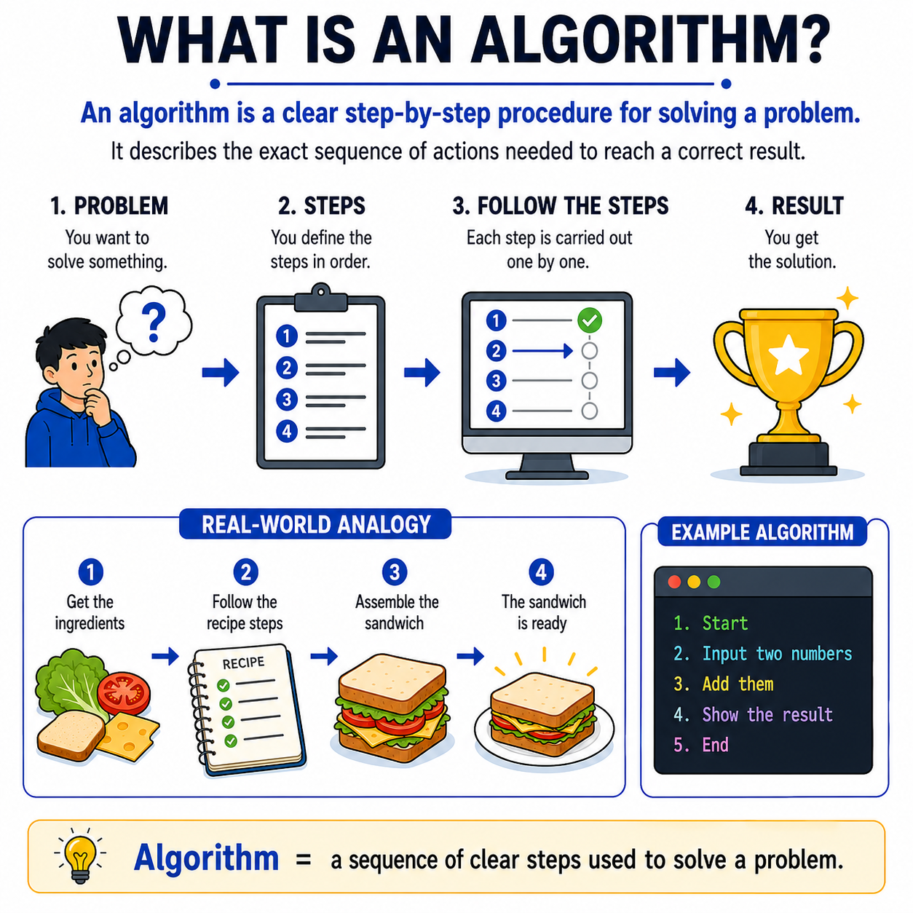

# 🌟 Programming Concepts Visualized

## Level 1: Programming Foundations
### 🔍 Module 5: What Is an Algorithm?

> **One concept. One visual. One clear explanation at a time.**

---



---

## 💡 The Core Idea

An algorithm does not have to feel complicated at the beginning.

At its core, an algorithm is simply a **clear step-by-step procedure for solving a problem**.

Before beginners start worrying about syntax, programming languages, data structures, or optimization, they first need to understand the main idea:

> [!NOTE]
> 1. You have a **problem** to solve
> 2. You define the **steps** in the correct order
> 3. You follow those steps **one by one**
> 4. You reach the **final result**
>
> That is the foundation.

---

## 🍳 Real-World Analogy: Making a Sandwich

Think of it like making a sandwich.

If you want to prepare a sandwich, you do not do everything randomly.
You follow a sequence of steps:

1.  **Get the ingredients 🥖**
2.  **Follow the recipe steps 📝**
3.  **Assemble the sandwich 🥪**
4.  **The sandwich is ready ✅**

Programming works in a very similar way.

> [!TIP]
> **An algorithm is the plan.**
>
> It describes exactly what should happen, step by step, to move from a problem to a solution.

---

## ⚙️ A Simple Algorithm Example

A simple example of an algorithm could be:

```
Start
  ↓
Input two numbers
  ↓
Add them
  ↓
Show the result
  ↓
End
```

This is the essence of **algorithmic thinking**.

---

## 📊 Algorithm at a Glance

| Aspect | Description |
| :--- | :--- |
| **What is it?** | A clear, step-by-step procedure for solving a problem |
| **Key principle** | Define steps in the correct order, then follow them one by one |
| **Analogy** | Like following a recipe to make a sandwich |
| **Goal** | Move from a problem to a solution in an organized way |
| **Foundation for** | Writing code, designing systems, and solving complex problems |

---

## 🎯 Key Takeaway

> [!TIP]
> **Coding is not only about writing syntax.**
> 
> It is also about learning how to **think clearly, logically, and step by step**.
>
> Once students understand what an algorithm really is, they become much better at **solving problems**, **writing code**, and **organizing their thoughts**.

---

### 🏷️ Series Tags
`#Programming` `#Coding` `#LearnToCode` `#ProgrammingEducation` `#ComputerScience` `#SoftwareDevelopment` `#TeachingProgramming` `#CodingForBeginners` `#ProgrammingConcepts` `#Algorithms` `#ProblemSolving` `#Education`

## 📢 Stay Updated

Be sure to ⭐ this repository to stay updated with new examples and enhancements!

## 📄 License

⚖️ This repository uses a hybrid licensing model to protect its custom educational visuals:

*   **Explanations & Code:** Licensed under the permissive [MIT License](https://mit-license.org/).
*   **Visual Assets & Diagrams:** Copyright © [Panagiotis Moschos](https://www.linkedin.com/in/panagiotis-moschos). **All Rights Reserved.** Any reproduction, modification, redistribution, or commercial use of the images, illustrations, or diagrams in this repository requires explicit written permission.

## Contact 📧
Panagiotis Moschos - pan.moschos86@gmail.com

---
<h1 align=center>Happy Coding 👨‍💻 </h1>

<p align="center">
  Made with ❤️ by 
  <a href="https://www.linkedin.com/in/panagiotis-moschos" target="_blank">
  Panagiotis Moschos</a>
</p>