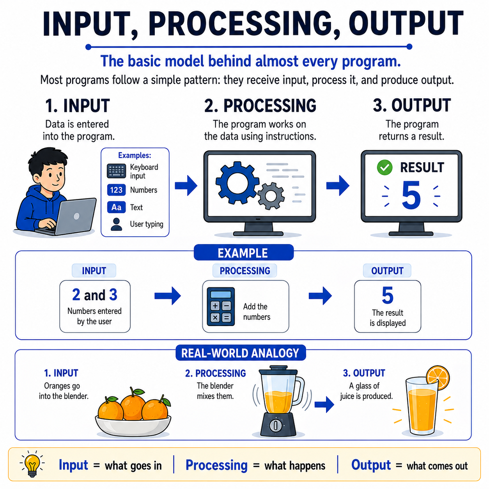

# 🌟 Programming Concepts Visualized

## Level 1: Programming Foundations
### 🔍 Module 6: Input, Processing, Output

> **One concept. One visual. One clear explanation at a time.**

---



---

## 💡 The Core Idea

Programming does not have to feel confusing at the beginning.

One of the simplest and most important ideas beginners should understand is this:

> [!NOTE]
> Most programs follow the same basic pattern:
>
> 1. They receive **Input**
> 2. They **Process** that input
> 3. They produce **Output**
>
> That is one of the core mental models in computer science.

---

## 📥📦📤 The Three Stages

*   **Input** is the data that goes into a program.
    This could be numbers, text, keyboard input, mouse clicks, or anything the user provides.

*   **Processing** is what the program does with that data.
    It applies instructions, performs calculations, checks conditions, or transforms the information.

*   **Output** is the final result the program returns.
    This could be a number on the screen, a message, an image, or any visible result.

---

## ⚙️ A Simple Example: Adding Two Numbers

```
Input:      2 and 3
Processing: The program adds them
Output:     5
```

That is the entire cycle — data goes in, work happens, a result comes out.

---

## 🍊 Real-World Analogy: Making Orange Juice

Think of it like making orange juice:

1.  **Input 🍊:** Oranges go into the blender
2.  **Processing 🔄:** The blender mixes them
3.  **Output 🥤:** A glass of juice is produced

Programming works in a very similar way.

> [!TIP]
> **Every program, no matter how complex, follows this fundamental pattern:**
>
> **Something goes in → Something happens → Something comes out.**

---

## 📊 Input, Processing, Output at a Glance

| Stage | Description | Example (Adding Numbers) | Example (Orange Juice) |
| :--- | :--- | :--- | :--- |
| **Input** | The data the program receives | `2` and `3` | Oranges 🍊 |
| **Processing** | What the program does with the data | Adds them together | Blending 🔄 |
| **Output** | The final result produced | `5` | A glass of juice 🥤 |

---

## 🎯 Key Takeaway

> [!TIP]
> **Students should first understand these simple patterns** before moving into syntax, functions, or more advanced concepts.
>
> Once students clearly understand **input, processing, and output**, many other programming ideas become much easier to follow.

---

### 🏷️ Series Tags
`#Programming` `#Coding` `#LearnToCode` `#ProgrammingEducation` `#ComputerScience` `#SoftwareDevelopment` `#TeachingProgramming` `#CodingForBeginners` `#ProgrammingConcepts` `#InputProcessingOutput` `#ProblemSolving` `#Education`

## 📢 Stay Updated

Be sure to ⭐ this repository to stay updated with new examples and enhancements!

## 📄 License

⚖️ This repository uses a hybrid licensing model to protect its custom educational visuals:

*   **Explanations & Code:** Licensed under the permissive [MIT License](https://mit-license.org/).
*   **Visual Assets & Diagrams:** Copyright © [Panagiotis Moschos](https://www.linkedin.com/in/panagiotis-moschos). **All Rights Reserved.** Any reproduction, modification, redistribution, or commercial use of the images, illustrations, or diagrams in this repository requires explicit written permission.

## Contact 📧
Panagiotis Moschos - pan.moschos86@gmail.com

---
<h1 align=center>Happy Coding 👨‍💻 </h1>

<p align="center">
  Made with ❤️ by 
  <a href="https://www.linkedin.com/in/panagiotis-moschos" target="_blank">
  Panagiotis Moschos</a>
</p>