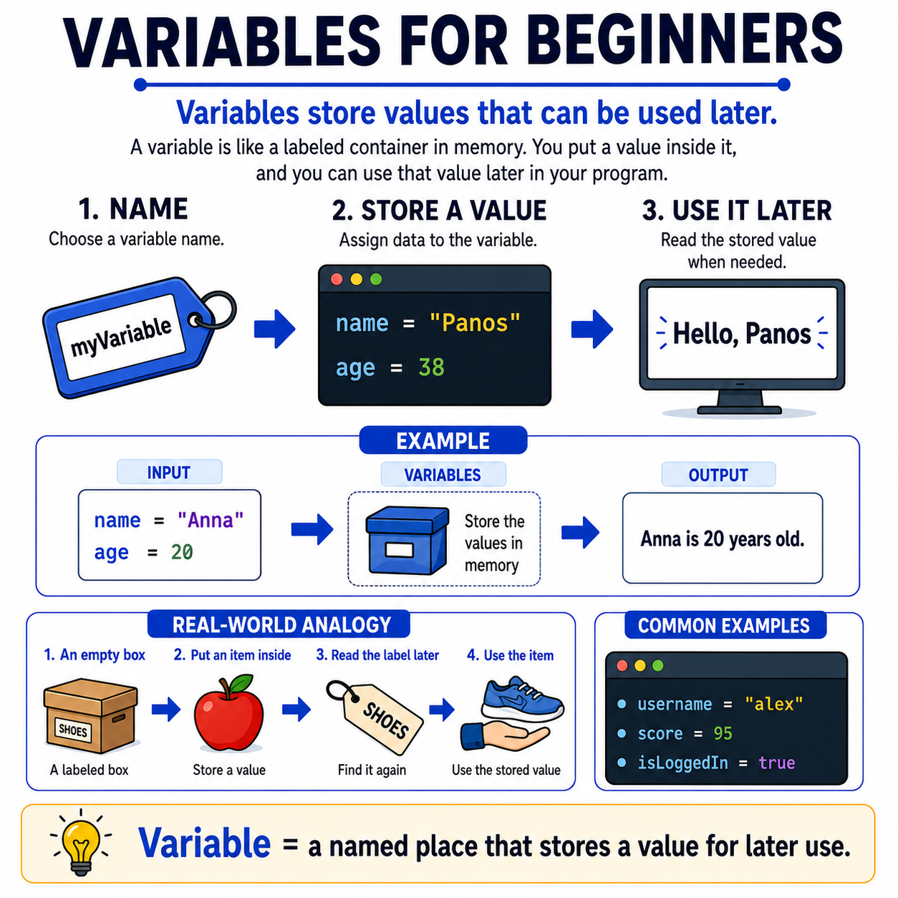

# 🌟 Programming Concepts Visualized

## Level 1: Programming Foundations
### 🔍 Module 7: Variables for Beginners

> **One concept. One visual. One clear explanation at a time.**

---



---

## 💡 The Core Idea

Variables do not have to feel confusing at the beginning.

At their core, variables are simply **named places that store values for later use**.

Before beginners start worrying about syntax rules, data types, or more advanced programming concepts, they first need to understand the basic mental model:

> [!NOTE]
> 1. You choose a **name**
> 2. You store a **value**
> 3. You use that value **later** in the program
>
> That is the foundation.

---

## 📦 Real-World Analogy: The Labeled Box

Imagine you have a box with a label on it.

You can put something inside the box, and later, when you need it, you look at the label and retrieve what you stored.

Programming works in a similar way.

> [!TIP]
> **A variable is like a labeled box in memory.**
>
> The label is the **name**. The contents are the **value**.

---

## ⚙️ A Simple Example

```python
name = "Anna"
age = 20
```

Now the program can remember those values and use them later, such as displaying:

```
Anna is 20 years old.
```

That is why variables are so important — they help programs **store information**, **organize data**, and **reuse values** whenever needed.

---

## 📊 Variables at a Glance

| Aspect | Description |
| :--- | :--- |
| **What is it?** | A named place in memory that stores a value |
| **Analogy** | A labeled box — the label is the name, the contents are the value |
| **How it works** | Choose a name → Store a value → Use it later |
| **Why it matters** | Programs need to remember and reuse information |
| **Appears in** | Every programming language, everywhere in code |

---

## 🎯 Key Takeaway

> [!TIP]
> **Variables are one of the first concepts students should truly understand**, because they appear everywhere in code.
>
> Once students understand that a variable is just a **named place for storing data**, programming starts to feel much more **logical and manageable**.

---

### 🏷️ Series Tags
`#Programming` `#Coding` `#LearnToCode` `#ProgrammingEducation` `#ComputerScience` `#SoftwareDevelopment` `#TeachingProgramming` `#CodingForBeginners` `#ProgrammingConcepts` `#Variables` `#Education` `#CodeNewbies`

## 📢 Stay Updated

Be sure to ⭐ this repository to stay updated with new examples and enhancements!

## 📄 License

⚖️ This repository uses a hybrid licensing model to protect its custom educational visuals:

*   **Explanations & Code:** Licensed under the permissive [MIT License](https://mit-license.org/).
*   **Visual Assets & Diagrams:** Copyright © [Panagiotis Moschos](https://www.linkedin.com/in/panagiotis-moschos). **All Rights Reserved.** Any reproduction, modification, redistribution, or commercial use of the images, illustrations, or diagrams in this repository requires explicit written permission.

## Contact 📧
Panagiotis Moschos - pan.moschos86@gmail.com

---
<h1 align=center>Happy Coding 👨‍💻 </h1>

<p align="center">
  Made with ❤️ by 
  <a href="https://www.linkedin.com/in/panagiotis-moschos" target="_blank">
  Panagiotis Moschos</a>
</p>