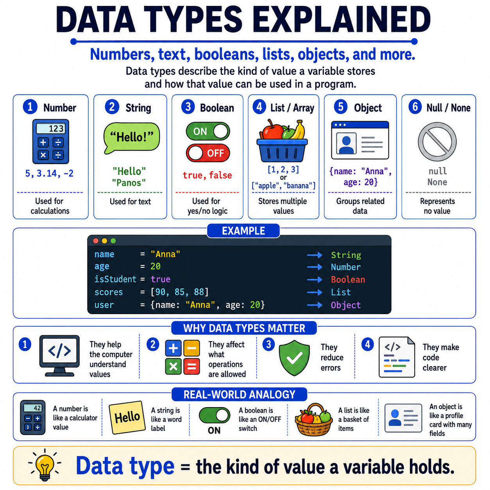

# 🌟 Programming Concepts Visualized

## Level 1: Programming Foundations
### 🔍 Module 8: Data Types Explained

> **One concept. One visual. One clear explanation at a time.**

---



---

## 💡 The Core Idea

Data types do not have to feel complicated at the beginning.

At their core, data types simply describe **what kind of value a variable holds** and **how that value can be used** in a program.

Before beginners start diving into more advanced programming concepts, they first need to understand a very important idea:

> [!NOTE]
> **Not all values are the same.**
>
> A program may store:
> - **Numbers** for calculations
> - **Strings** for text
> - **Booleans** for true/false decisions
> - **Lists/Arrays** for multiple values
> - **Objects** for grouped related data
> - **Null / None** for the absence of a value
>
> That is the foundation.

---

## ⚙️ A Simple Example

```python
name = "Anna"           # → String
age = 20                # → Number
isStudent = True        # → Boolean
scores = [90, 85, 88]   # → List
user = {"name": "Anna", "age": 20}  # → Object
```

Each value has a specific **type** that determines what operations are allowed and how the program handles it.

---

## 🏷️ Real-World Analogy: Containers & Labels

A simple real-world analogy helps a lot. You can think of data types like different kinds of containers or labels:

| Data Type | Analogy |
| :--- | :--- |
| **Number** | A calculator value 🔢 |
| **String** | A word label 🏷️ |
| **Boolean** | An ON/OFF switch 🔘 |
| **List** | A basket of items 🧺 |
| **Object** | A profile card with multiple fields 📇 |

---

## ❓ Why Does This Matter?

Because data types help the computer understand:

*   ✅ What a value **represents**
*   ✅ What **operations** are allowed
*   ✅ How to **avoid errors**
*   ✅ How to make code **clearer and more organized**

---

## 📊 Data Types at a Glance

| Data Type | Description | Example |
| :--- | :--- | :--- |
| **String** | Text values | `"Anna"` |
| **Number** | Numeric values (int or float) | `20`, `3.14` |
| **Boolean** | True or false | `True`, `False` |
| **List / Array** | Ordered collection of values | `[90, 85, 88]` |
| **Object / Dict** | Key-value pairs of related data | `{name: "Anna", age: 20}` |
| **Null / None** | Absence of a value | `None` |

---

## 🎯 Key Takeaway

> [!TIP]
> **Data types are one of the key mental models beginners need early on.**
>
> Once students understand that **different values have different types**, code starts to make much more sense.

---

### 🏷️ Series Tags
`#Programming` `#Coding` `#LearnToCode` `#ProgrammingEducation` `#ComputerScience` `#SoftwareDevelopment` `#TeachingProgramming` `#CodingForBeginners` `#ProgrammingConcepts` `#DataTypes` `#Education` `#CodeNewbies`

## 📢 Stay Updated

Be sure to ⭐ this repository to stay updated with new examples and enhancements!

## 📄 License

⚖️ This repository uses a hybrid licensing model to protect its custom educational visuals:

*   **Explanations & Code:** Licensed under the permissive [MIT License](https://mit-license.org/).
*   **Visual Assets & Diagrams:** Copyright © [Panagiotis Moschos](https://www.linkedin.com/in/panagiotis-moschos). **All Rights Reserved.** Any reproduction, modification, redistribution, or commercial use of the images, illustrations, or diagrams in this repository requires explicit written permission.

## Contact 📧
Panagiotis Moschos - pan.moschos86@gmail.com

---
<h1 align=center>Happy Coding 👨‍💻 </h1>

<p align="center">
  Made with ❤️ by 
  <a href="https://www.linkedin.com/in/panagiotis-moschos" target="_blank">
  Panagiotis Moschos</a>
</p>