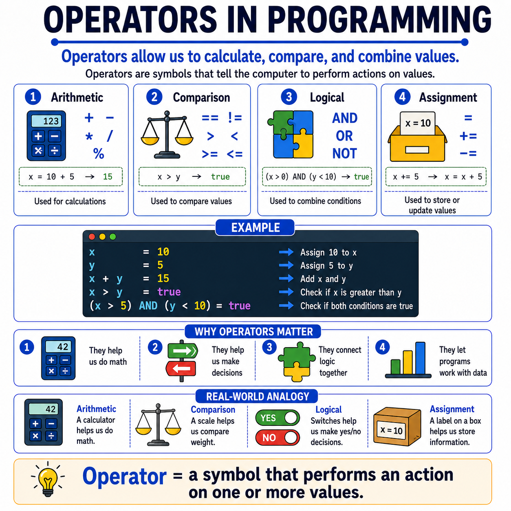

# 🌟 Programming Concepts Visualized

## Level 1: Programming Foundations
### 🔍 Module 9: Operators in Programming

> **One concept. One visual. One clear explanation at a time.**

---



---

## 💡 The Core Idea

Operators do not have to feel complicated at the beginning.

At their core, operators are simply **symbols that tell the computer to perform actions on values**.

They help us do some of the most common things in programming:

> [!NOTE]
> - **Calculate** values
> - **Compare** values
> - **Combine** conditions
> - **Store or update** data
>
> That is the foundation.

---

## 📂 Common Operator Categories

| Category | Purpose | Symbols |
| :--- | :--- | :--- |
| **Arithmetic** | Calculations | `+`, `-`, `*`, `/`, `%` |
| **Comparison** | Checking relationships | `==`, `!=`, `>`, `<`, `>=`, `<=` |
| **Logical** | Combining conditions | `AND`, `OR`, `NOT` |
| **Assignment** | Storing or updating values | `=`, `+=`, `-=` |

---

## ⚙️ A Simple Example

```python
x = 10
y = 5

x + y        # → 15                (Arithmetic)
x > y        # → True              (Comparison)
(x > 5) and (y < 10)  # → True    (Logical)
```

In this small example, operators are doing all the important work:

*   They **assign** values
*   They **perform math**
*   They **compare** results
*   They help the program **make decisions**

---

## 🔧 Real-World Analogy

| Operator Type | Analogy |
| :--- | :--- |
| **Arithmetic** | Using a calculator 🧮 |
| **Comparison** | Using a scale to compare weight ⚖️ |
| **Logical** | Yes/No switches that help us decide 🔘 |
| **Assignment** | Putting a label on a box to store information 📦 |

Programming works in a very similar way.

---

## 📊 Operators at a Glance

| Aspect | Description |
| :--- | :--- |
| **What are they?** | Symbols that perform actions on values |
| **Why they matter** | They power calculations, comparisons, decisions, and data storage |
| **When you see them** | Almost immediately in real code |
| **Key categories** | Arithmetic, Comparison, Logical, Assignment |

---

## 🎯 Key Takeaway

> [!TIP]
> **Operators are one of the most essential early concepts**, because students see them almost immediately in real code.
>
> Once students understand that an operator is simply a **symbol that performs an action on one or more values**, code becomes much easier to **read and reason about**.

---

### 🏷️ Series Tags
`#Programming` `#Coding` `#LearnToCode` `#ProgrammingEducation` `#ComputerScience` `#SoftwareDevelopment` `#TeachingProgramming` `#CodingForBeginners` `#ProgrammingConcepts` `#Operators` `#Education` `#CodeNewbies`

## 📢 Stay Updated

Be sure to ⭐ this repository to stay updated with new examples and enhancements!

## 📄 License

⚖️ This repository uses a hybrid licensing model to protect its custom educational visuals:

*   **Explanations & Code:** Licensed under the permissive [MIT License](https://mit-license.org/).
*   **Visual Assets & Diagrams:** Copyright © [Panagiotis Moschos](https://www.linkedin.com/in/panagiotis-moschos). **All Rights Reserved.** Any reproduction, modification, redistribution, or commercial use of the images, illustrations, or diagrams in this repository requires explicit written permission.

## Contact 📧
Panagiotis Moschos - pan.moschos86@gmail.com

---
<h1 align=center>Happy Coding 👨‍💻 </h1>

<p align="center">
  Made with ❤️ by 
  <a href="https://www.linkedin.com/in/panagiotis-moschos" target="_blank">
  Panagiotis Moschos</a>
</p>