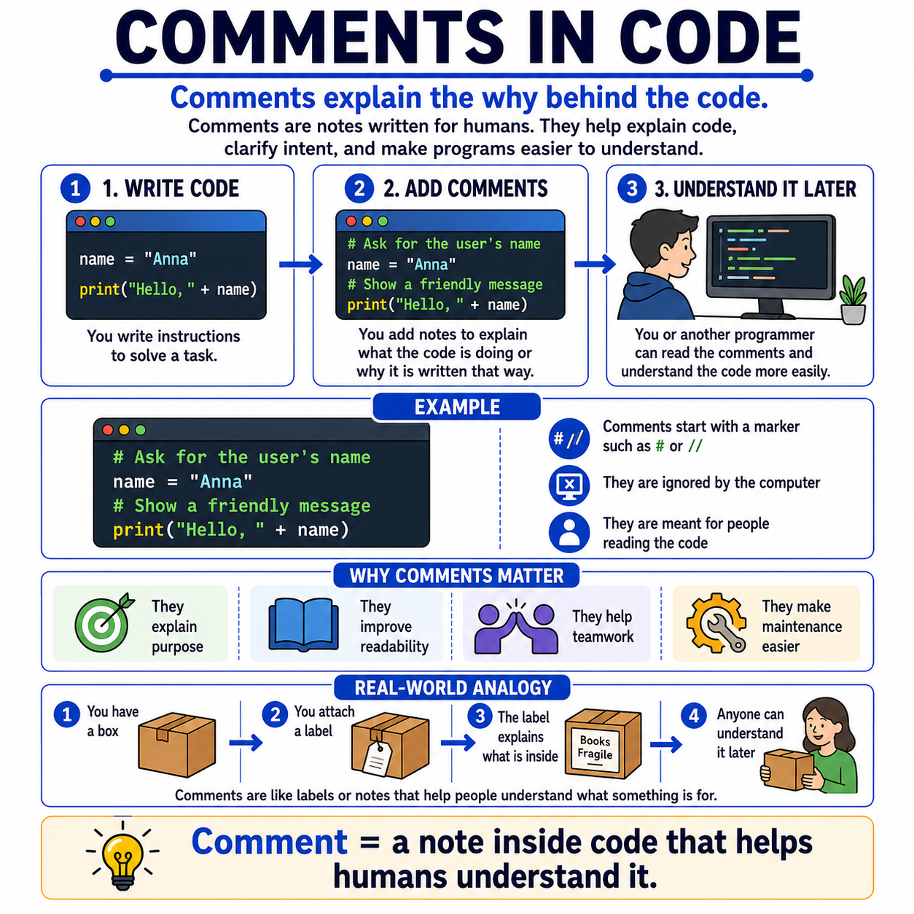

# 🌟 Programming Concepts Visualized

## Level 1: Programming Foundations
### 🔍 Module 10: Comments in Code

> **One concept. One visual. One clear explanation at a time.**

---



---

## 💡 The Core Idea

Comments do not change what a program does, but they can greatly improve how easily humans understand it.

At their core, comments are simply **notes written inside code for people**.

They help explain:

> [!NOTE]
> - **What** the code is doing
> - **Why** a piece of code exists
> - **What** the programmer intended
> - **What** another developer should know later
>
> That is the foundation.

---

## 🚫 A Very Important Idea for Beginners

> [!IMPORTANT]
> **The computer ignores comments.**
>
> Comments are not written for execution.
> They are written for **readability** and **understanding**.

---

## ⚙️ A Simple Example

```python
# Ask for the user's name
name = "Anna"

# Show a friendly message
print("Hello, " + name)
```

The program runs because of the code itself.
But the comments make the **purpose** much clearer for the person reading it.

---

## ❓ Why Comments Matter

Comments help:

*   ✅ **Explain** the purpose of code
*   ✅ **Improve** readability
*   ✅ **Support** teamwork
*   ✅ **Make maintenance** easier

---

## 📦 Real-World Analogy: The Labeled Box

Imagine you have a box.
Then you attach a label that explains what is inside or how it should be handled.

The label does not change the box itself, but it helps other people understand it more easily.

Programming works in a very similar way.

> [!TIP]
> **Comments are like those labels.**
>
> They add **context**, **meaning**, and **clarity**.

---

## 📊 Comments at a Glance

| Aspect | Description |
| :--- | :--- |
| **What are they?** | Notes written inside code for humans, not the computer |
| **Who are they for?** | Developers — including your future self |
| **Does the computer run them?** | No — they are completely ignored during execution |
| **Why they matter** | They explain purpose, improve readability, and support teamwork |
| **Analogy** | Like a label on a box — adds context without changing the contents |

---

## 🎯 Key Takeaway

> [!TIP]
> **Writing code is not only about making the computer understand instructions.**
> It is also about helping **humans understand the code later** — including their future selves.
>
> **Good code** solves the problem.
> **Good comments** help explain the thinking behind it.

---

### 🏷️ Series Tags
`#Programming` `#Coding` `#LearnToCode` `#ProgrammingEducation` `#ComputerScience` `#SoftwareDevelopment` `#TeachingProgramming` `#CodingForBeginners` `#ProgrammingConcepts` `#CommentsInCode` `#CleanCode` `#Education`

## 📢 Stay Updated

Be sure to ⭐ this repository to stay updated with new examples and enhancements!

## 📄 License

⚖️ This repository uses a hybrid licensing model to protect its custom educational visuals:

*   **Explanations & Code:** Licensed under the permissive [MIT License](https://mit-license.org/).
*   **Visual Assets & Diagrams:** Copyright © [Panagiotis Moschos](https://www.linkedin.com/in/panagiotis-moschos). **All Rights Reserved.** Any reproduction, modification, redistribution, or commercial use of the images, illustrations, or diagrams in this repository requires explicit written permission.

## Contact 📧
Panagiotis Moschos - pan.moschos86@gmail.com

---
<h1 align=center>Happy Coding 👨‍💻 </h1>

<p align="center">
  Made with ❤️ by 
  <a href="https://www.linkedin.com/in/panagiotis-moschos" target="_blank">
  Panagiotis Moschos</a>
</p>