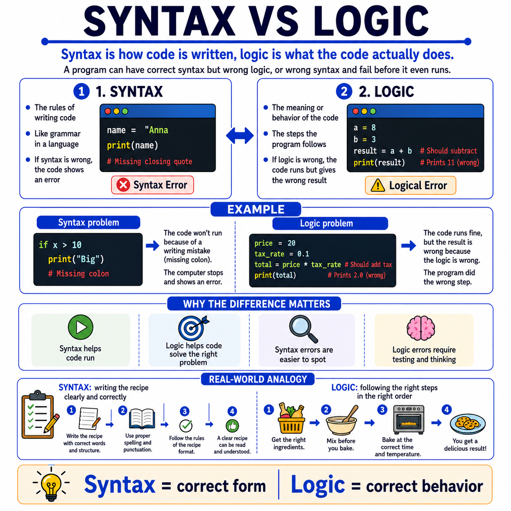

# 🌟 Programming Concepts Visualized

## Level 1: Programming Foundations
### 🔍 Module 11: Syntax vs Logic

> **One concept. One visual. One clear explanation at a time.**

---



---

## 💡 The Core Idea

Syntax vs logic is one of the most important distinctions beginners need to understand.

At first, many students think that if code runs, then it must be correct. But that is not always true.

> [!NOTE]
> A program can have:
> - **Correct syntax** but **wrong logic**
> - **Wrong syntax** and fail before it even runs
>
> That is the key idea.

---

## ✍️ What is Syntax?

Syntax is about **how code is written**. It is like the **grammar** of a programming language.

If syntax is wrong, the computer usually stops and shows an error.

```python
if x > 10
    print("Big")
```

> [!WARNING]
> This code has a **syntax problem** because the colon `:` is missing.
> The program **cannot run**.

---

## 🧠 What is Logic?

Logic is about **what the code actually does**.

A program may run perfectly, but still produce the **wrong result** because the steps are incorrect.

```python
price = 20
tax_rate = 0.1
total = price * tax_rate
print(total)
```

The syntax is valid, so the code runs. But the logic is **wrong** if the goal was to calculate the final price with tax.

> [!IMPORTANT]
> Logic errors can be **harder to find** than syntax errors because the program does not crash — it simply gives the **wrong answer**.

---

## 📦 Real-World Analogy: Cooking

A simple analogy is cooking.

- **Syntax** is like writing the recipe clearly and correctly. You need proper words, structure, and format so someone can understand it.
- **Logic** is like following the right cooking steps in the right order. Even if the recipe is written correctly, the result can still fail if you mix, bake, or prepare things in the wrong way.

> [!TIP]
> Programming works in a very similar way.
>
> **Syntax** helps the code **run**.
> **Logic** helps the code **solve the right problem**.

---

## 📊 Syntax vs Logic at a Glance

| Aspect | Syntax | Logic |
| :--- | :--- | :--- |
| **What is it?** | The grammar and structure of code | The correctness of the steps and reasoning |
| **What happens if wrong?** | The program crashes or shows an error | The program runs but gives the wrong result |
| **Easy to detect?** | Yes — the compiler/interpreter flags it | No — you must test and reason through it |
| **Analogy** | Writing a recipe clearly | Following the right cooking steps |
| **Fix approach** | Read the error message and correct the structure | Trace the logic and verify the expected output |

---

## 🎯 Key Takeaway

> [!TIP]
> **Fixing syntax errors is only the first step.**
> The deeper skill is learning how to **think through the logic** of a solution.
>
> Once students understand the difference between syntax and logic, **debugging becomes much more meaningful**.

---

### 🏷️ Series Tags
`#Programming` `#Coding` `#LearnToCode` `#ProgrammingEducation` `#ComputerScience` `#SoftwareDevelopment` `#TeachingProgramming` `#CodingForBeginners` `#ProgrammingConcepts` `#Syntax` `#Logic` `#Debugging` `#Education`

## 📢 Stay Updated

Be sure to ⭐ this repository to stay updated with new examples and enhancements!

## 📄 License

⚖️ This repository uses a hybrid licensing model to protect its custom educational visuals:

*   **Explanations & Code:** Licensed under the permissive [MIT License](https://mit-license.org/).
*   **Visual Assets & Diagrams:** Copyright © [Panagiotis Moschos](https://www.linkedin.com/in/panagiotis-moschos). **All Rights Reserved.** Any reproduction, modification, redistribution, or commercial use of the images, illustrations, or diagrams in this repository requires explicit written permission.

## Contact 📧
Panagiotis Moschos - pan.moschos86@gmail.com

---
<h1 align=center>Happy Coding 👨‍💻 </h1>

<p align="center">
  Made with ❤️ by 
  <a href="https://www.linkedin.com/in/panagiotis-moschos" target="_blank">
  Panagiotis Moschos</a>
</p>