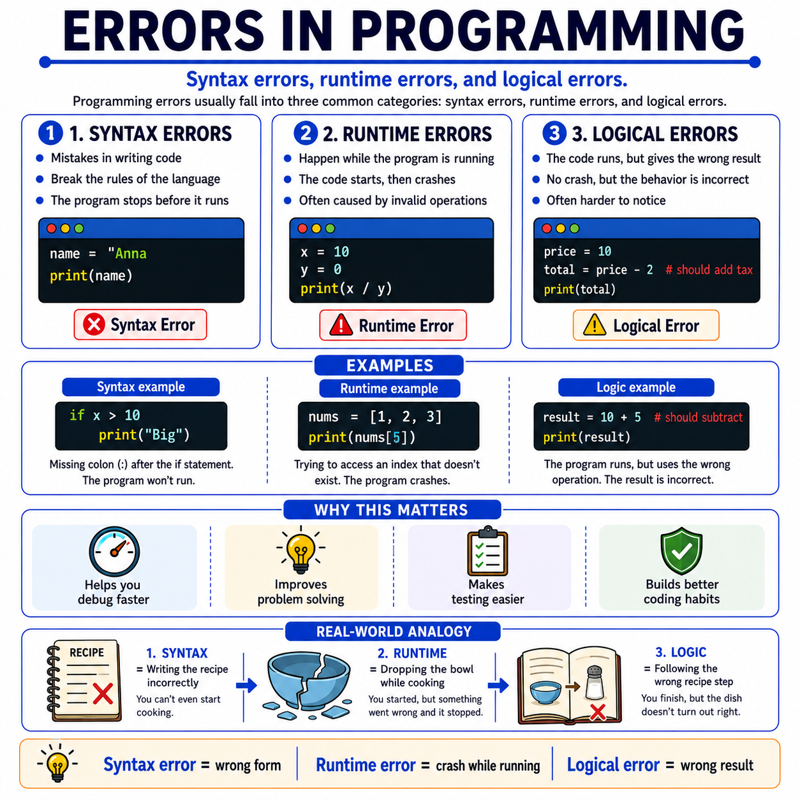

# 🌟 Programming Concepts Visualized

## Level 1: Programming Foundations
### 🔍 Module 12: Errors in Programming

> **One concept. One visual. One clear explanation at a time.**

---



---

## 💡 The Core Idea

Errors in programming do not mean failure. They are a **normal part of learning** how to code.

At the beginning, many students think that an error means they are "bad at programming". But in reality, errors are one of the main ways we learn how programs work.

> [!NOTE]
> Most programming errors usually fall into **three common categories**:
> - **Syntax errors**
> - **Runtime errors**
> - **Logical errors**

---

## 🚫 Syntax Errors

A syntax error happens when the code **breaks the rules of the language**. This means the program **cannot even start** properly.

```python
if x > 10
    print("Big")
```

> [!WARNING]
> The colon `:` is missing — the program **fails before it runs**.

---

## 💥 Runtime Errors

A runtime error happens **while the program is running**. The code starts, but something goes wrong during execution, so the program **crashes or stops**.

```python
result = 10 / 0
print(result)
```

> [!WARNING]
> The code is syntactically correct, but dividing by zero causes a **crash during execution**.

---

## 🧠 Logical Errors

A logical error happens when the code runs **without crashing**, but the result is **wrong** because the logic is incorrect.

```python
price = 20
tax_rate = 0.1
total = price * tax_rate
print(total)
```

> [!IMPORTANT]
> The syntax is valid and the program runs, but the output is **wrong** if the goal was to calculate the final price with tax.
> Logical errors are the **hardest to detect** because the program does not crash — it simply gives the **wrong answer**.

---

## ⚠️ A Very Important Distinction

> [!NOTE]
> - A program may **fail before it runs** → Syntax Error
> - A program may **crash while running** → Runtime Error
> - A program may **run successfully** and still produce the **wrong answer** → Logical Error

---

## 📦 Real-World Analogy: Cooking

A simple real-world analogy is cooking:

- 🚫 **Syntax error** = writing the recipe incorrectly, so you **cannot even begin**
- 💥 **Runtime error** = dropping the bowl while cooking, so the **process stops**
- 🧠 **Logical error** = following the wrong recipe step, so the **final dish turns out wrong**

> [!TIP]
> Programming works in a very similar way.
>
> Students should not be afraid of errors.
> They should learn to **read them**, **classify them**, and **use them as feedback**.

---

## 📊 Errors at a Glance

| Error Type | When It Happens | Effect | Easy to Detect? | Analogy |
| :--- | :--- | :--- | :--- | :--- |
| **Syntax Error** | Before the program runs | Program cannot start | ✅ Yes — the interpreter flags it | Writing the recipe incorrectly |
| **Runtime Error** | While the program is running | Program crashes mid-execution | ⚠️ Sometimes — depends on the case | Dropping the bowl while cooking |
| **Logical Error** | After the program runs | Wrong result, no crash | ❌ No — requires testing and reasoning | Following the wrong recipe step |

---

## 🎯 Key Takeaway

> [!TIP]
> **Errors are not just obstacles. They are part of the learning process.**
>
> Once students understand the difference between **syntax**, **runtime**, and **logical errors**, debugging becomes much **easier** and much more **meaningful**.

---

### 🏷️ Series Tags
`#Programming` `#Coding` `#LearnToCode` `#ProgrammingEducation` `#ComputerScience` `#SoftwareDevelopment` `#TeachingProgramming` `#CodingForBeginners` `#ProgrammingConcepts` `#Debugging` `#ErrorsInProgramming` `#Education`

## 📢 Stay Updated

Be sure to ⭐ this repository to stay updated with new examples and enhancements!

## 📄 License

⚖️ This repository uses a hybrid licensing model to protect its custom educational visuals:

*   **Explanations & Code:** Licensed under the permissive [MIT License](https://mit-license.org/).
*   **Visual Assets & Diagrams:** Copyright © [Panagiotis Moschos](https://www.linkedin.com/in/panagiotis-moschos). **All Rights Reserved.** Any reproduction, modification, redistribution, or commercial use of the images, illustrations, or diagrams in this repository requires explicit written permission.

## Contact 📧
Panagiotis Moschos - pan.moschos86@gmail.com

---
<h1 align=center>Happy Coding 👨‍💻 </h1>

<p align="center">
  Made with ❤️ by 
  <a href="https://www.linkedin.com/in/panagiotis-moschos" target="_blank">
  Panagiotis Moschos</a>
</p>