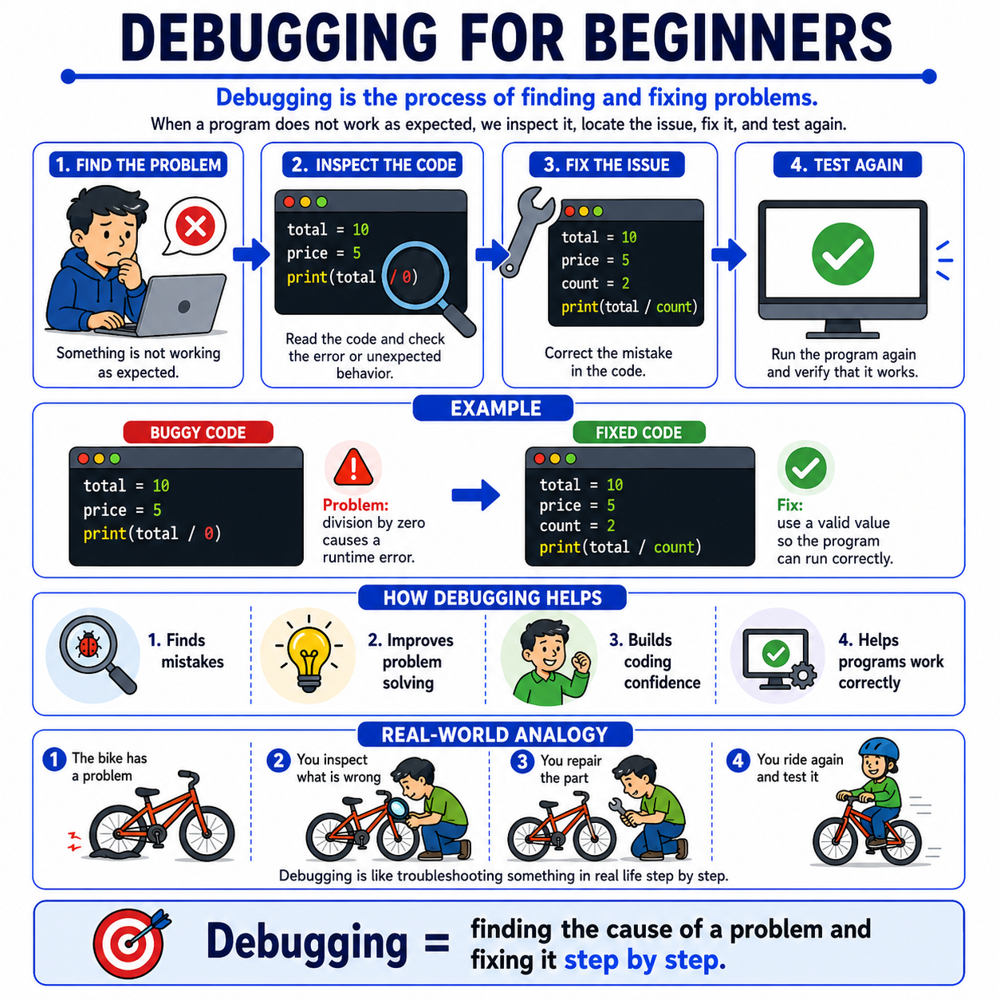

# 🌟 Programming Concepts Visualized

## Level 1: Programming Foundations
### 🔍 Module 13: Debugging for Beginners

> **One concept. One visual. One clear explanation at a time.**

---



---

## 💡 The Core Idea

Debugging does not have to feel frustrating at the beginning.

At its core, debugging is simply the process of **finding and fixing problems** in a program.

When a program does not work as expected, we do not guess randomly. We follow a clear process.

---

## 🔄 The Debugging Process

When debugging, we follow a systematic, step-by-step approach:

1. **Find the problem**
2. **Inspect the code**
3. **Fix the issue**
4. **Test again**

That is the foundation.

---

## 💥 A Simple Example: Runtime Error

Consider this program:

```python
total = 10
price = 5

print(total / 0)
```

> [!WARNING]
> **The problem:** Division by zero.
> The program starts running, but then crashes because the operation is invalid.

### 🛠️ How We Debug It
We inspect the code, identify the cause, and replace the invalid value with a valid one:

```python
total = 10
price = 5
count = 2

print(total / count)
```

Now, the program can run correctly.

---

## 🚲 Real-World Analogy: Fixing a Bicycle

A useful real-world analogy is fixing a bicycle.

If the bike has a problem, you do not replace everything immediately:
*   You **inspect** what is wrong.
*   You **repair** the broken part.
*   Then you **ride again** and test if it works.

Debugging works in a very similar way. It teaches students to slow down, observe carefully, and think step by step.

---

## 📊 Debugging Process at a Glance

| Step | Action | Description | Analogy (Bicycle) |
| :--- | :--- | :--- | :--- |
| **1. Find the problem** | Identify symptoms | Notice that the program is not working or crashing. | The bicycle doesn't ride or makes a weird noise. |
| **2. Inspect the code** | Analyze the source | Look at the code to locate the line or logic causing the issue. | Look closely at the chain, tires, or brakes to see what is broken. |
| **3. Fix the issue** | Implement solution | Make a precise change to resolve the root cause. | Repair the flat tire or put the chain back on. |
| **4. Test again** | Verify correctness | Run the program again to ensure it works and no new errors are introduced. | Take the bike for a quick spin to check if it's fixed. |

---

## 🎯 Key Takeaway

> [!TIP]
> **Debugging is one of the most important skills beginners can develop.**
>
> Programming is not only about writing code that works immediately. It is also about learning how to understand what went wrong and how to fix it.
>
> Once students realize that errors are normal and debugging is part of the process, they become more confident problem solvers.

---

### 🏷️ Series Tags
`#Programming` `#Coding` `#LearnToCode` `#ProgrammingEducation` `#ComputerScience` `#SoftwareDevelopment` `#TeachingProgramming` `#CodingForBeginners` `#ProgrammingConcepts` `#Debugging` `#ProblemSolving` `#Education`

## 📢 Stay Updated

Be sure to ⭐ this repository to stay updated with new examples and enhancements!

## 📄 License

⚖️ This repository uses a hybrid licensing model to protect its custom educational visuals:

*   **Explanations & Code:** Licensed under the permissive [MIT License](https://mit-license.org/).
*   **Visual Assets & Diagrams:** Copyright © [Panagiotis Moschos](https://www.linkedin.com/in/panagiotis-moschos). **All Rights Reserved.** Any reproduction, modification, redistribution, or commercial use of the images, illustrations, or diagrams in this repository requires explicit written permission.

## Contact 📧
Panagiotis Moschos - pan.moschos86@gmail.com

---
<h1 align=center>Happy Coding 👨‍💻 </h1>

<p align="center">
  Made with ❤️ by 
  <a href="https://www.linkedin.com/in/panagiotis-moschos" target="_blank">
  Panagiotis Moschos</a>
</p>