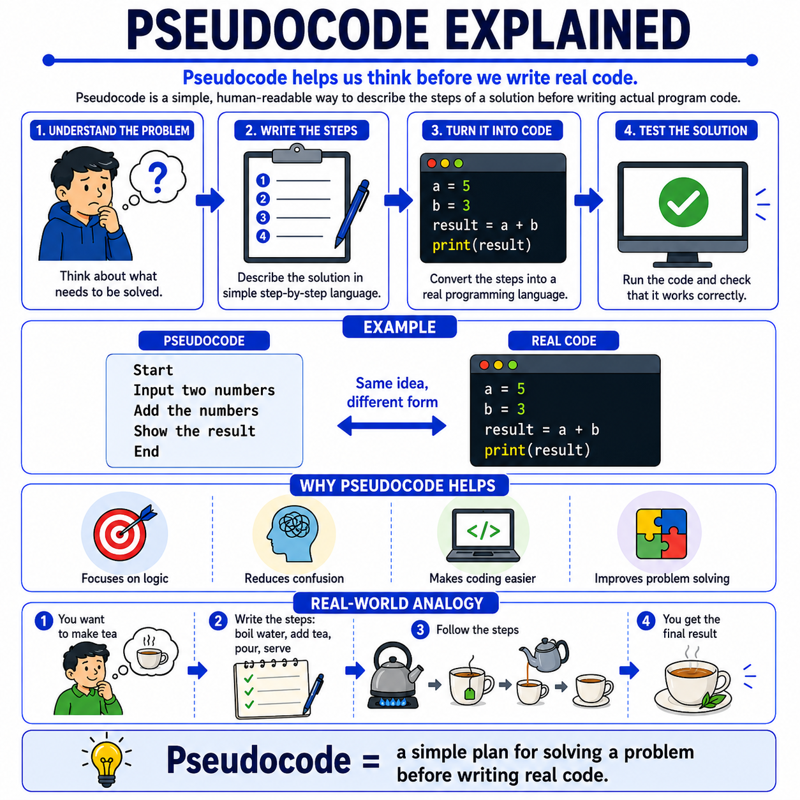

# 🌟 Programming Concepts Visualized

## Level 1: Programming Foundations
### 🔍 Module 14: Pseudocode Explained

> **One concept. One visual. One clear explanation at a time.**

---



---

## 💡 The Core Idea

Pseudocode does not have to feel complicated at the beginning.

At its core, pseudocode is simply a **human-readable way to describe the steps of a solution** before writing real code.

Before beginners start worrying about syntax, semicolons, indentation, or language-specific rules, they first need to focus on something more important: **the logic of the solution**.

> [!NOTE]
> Pseudocode helps students to:
> - **Understand the problem**
> - **Write the steps clearly**
> - **Think in order**
> - **Turn the idea into real code later**
>
> That is the foundation.

---

## ✍️ A Simple Example: Adding Two Numbers

A simple example of a task is adding two numbers together.

### 📝 The Pseudocode Plan
In pseudocode, the steps of the solution are written in plain, clear language:

```text
Start
  Input two numbers
  Add the numbers
  Show the result
End
```

### 💻 The Real Code Translation
Once the logic is clear, we can easily translate that exact plan into a programming language like Python:

```python
# Input two numbers
num1 = float(input("Enter first number: "))
num2 = float(input("Enter second number: "))

# Add the numbers
result = num1 + num2

# Show the result
print("The sum is:", result)
```

This is why pseudocode is so useful. It helps students focus on **what the program should do**, before worrying about **how a specific language wants it written**.

---

## 🍵 Real-World Analogy: Making Tea

A useful real-world analogy is making tea.

Before actually preparing it, you may first think through the steps:
1. **Boil water**
2. **Add tea**
3. **Pour**
4. **Serve**

That plan is not the final action itself, but it gives you a clear path to follow.

Programming works in a very similar way:
*   **Pseudocode** is the plan.
*   **Code** is the implementation.

---

## 📊 Pseudocode vs. Real Code

| Aspect | 📝 Pseudocode | 💻 Real Code |
| :--- | :--- | :--- |
| **Target Audience** | Humans (easy to read and write) | Computers (strict rules and syntax) |
| **Focus** | Logic, steps, and structure | Implementation details, syntax, and libraries |
| **Syntax Rules** | None — write in plain English/native language | Strict — semicolons, parentheses, indentations |
| **Execution** | Cannot be executed by a computer | Executed by compilers or interpreters |
| **Analogy** | A plan or recipe in your head | The actual cooking of the meal |

---

## 🎯 Key Takeaway

> [!TIP]
> **Pseudocode helps you solve the problem before you write the code.**
>
> Many students struggle not with typing code, but with organizing their thinking. Once students learn to break a problem into simple steps, writing the actual code becomes much easier.
>
> When teaching programming, pseudocode is one of the best tools for helping beginners build confidence.

---

### 🏷️ Series Tags
`#Programming` `#Coding` `#LearnToCode` `#ProgrammingEducation` `#ComputerScience` `#SoftwareDevelopment` `#TeachingProgramming` `#CodingForBeginners` `#ProgrammingConcepts` `#Pseudocode` `#ProblemSolving` `#Education`

## 📢 Stay Updated

Be sure to ⭐ this repository to stay updated with new examples and enhancements!

## 📄 License

⚖️ This repository uses a hybrid licensing model to protect its custom educational visuals:

*   **Explanations & Code:** Licensed under the permissive [MIT License](https://mit-license.org/).
*   **Visual Assets & Diagrams:** Copyright © [Panagiotis Moschos](https://www.linkedin.com/in/panagiotis-moschos). **All Rights Reserved.** Any reproduction, modification, redistribution, or commercial use of the images, illustrations, or diagrams in this repository requires explicit written permission.

## Contact 📧
Panagiotis Moschos - pan.moschos86@gmail.com

---
<h1 align=center>Happy Coding 👨‍💻 </h1>

<p align="center">
  Made with ❤️ by 
  <a href="https://www.linkedin.com/in/panagiotis-moschos" target="_blank">
  Panagiotis Moschos</a>
</p>