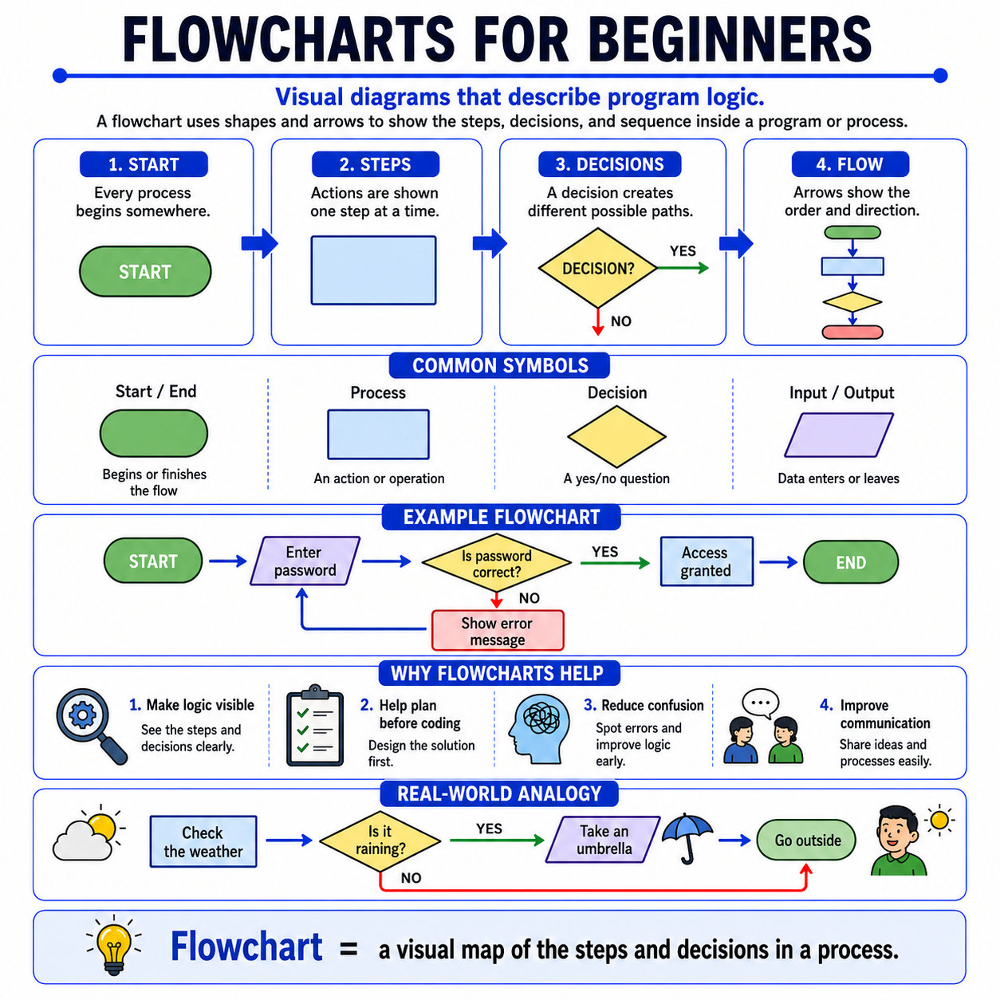

# 🌟 Programming Concepts Visualized

## Level 1: Programming Foundations
### 🔍 Module 15: Flowcharts for Beginners

> **One concept. One visual. One clear explanation at a time.**

---



---

## 💡 The Core Idea

Flowcharts do not have to feel complicated at the beginning.

At their core, flowcharts are simply **visual diagrams that describe the logic of a program or process**.

Before beginners start writing code, they often need a way to see the structure of their solution clearly. That is where flowcharts help.

> [!NOTE]
> A flowchart visually shows:
> - **Where a process starts**
> - **What steps happen**
> - **Where decisions are made**
> - **Which path the program follows**
> - **Where the process ends**
>
> Instead of looking at code immediately, students can first look at the logic visually.

---

## 🔄 A Simple Example: A Login Flow

Consider a basic authentication sequence. Rather than straight lines, programs often branch off into different directions based on conditions:

```text
Start
  └── Enter password
        └── Check if the password is correct?
              ├── [YES] ──> Grant access ──> End
              └── [NO]  ──> Show an error message ──> End
```

This simple flow helps beginners understand that programs are dynamic and must handle multiple conditions.

---

## 📐 Common Flowchart Symbols

Each shape in a flowchart represents a specific type of action or step:

| Symbol / Shape | Name | Description |
| :--- | :--- | :--- |
| 🕳️ **Oval** | Start / End | Marks the beginning or end of a flowchart path. |
| ⬜ **Rectangle** | Process / Action | Represents an operation, calculation, or instruction. |
| 🔶 **Diamond** | Decision | Represents a condition check or question (usually yes/no). |
| ▱ **Parallelogram** | Input / Output | Represents entering data into the program or showing results. |
| ➡️ **Arrows** | Flow Line | Shows the direction and path of execution. |

---

## ☔ Real-World Analogy: Taking an Umbrella

A useful real-world analogy is deciding whether to take an umbrella when you go outside.

1. **Start** (Get ready to leave the house).
2. **Action**: Check the weather.
3. **Decision**: Is it raining?
   - 🟢 **Yes** ──> Take an umbrella.
   - 🔴 **No** ──> Go outside without one.
4. **End** (Walk out the door).

This is exactly how program logic works. The computer checks conditions and chooses different paths based on the result.

---

## 🎯 Key Takeaway

> [!TIP]
> **Flowcharts make invisible logic visible.**
>
> They help students plan before coding, reduce confusion, spot mistakes earlier, and explain their thinking more clearly. Once students understand flowcharts, they can move from visual logic to real code with much more confidence.

---

### 🏷️ Series Tags
`#Programming` `#Coding` `#LearnToCode` `#ProgrammingEducation` `#ComputerScience` `#SoftwareDevelopment` `#TeachingProgramming` `#CodingForBeginners` `#ProgrammingConcepts` `#Flowcharts` `#ProblemSolving` `#Education`

## 📢 Stay Updated

Be sure to ⭐ this repository to stay updated with new examples and enhancements!

## 📄 License

⚖️ This repository uses a hybrid licensing model to protect its custom educational visuals:

*   **Explanations & Code:** Licensed under the permissive [MIT License](https://mit-license.org/).
*   **Visual Assets & Diagrams:** Copyright © [Panagiotis Moschos](https://www.linkedin.com/in/panagiotis-moschos). **All Rights Reserved.** Any reproduction, modification, redistribution, or commercial use of the images, illustrations, or diagrams in this repository requires explicit written permission.

## Contact 📧
Panagiotis Moschos - pan.moschos86@gmail.com

---
<h1 align=center>Happy Coding 👨‍💻 </h1>

<p align="center">
  Made with ❤️ by 
  <a href="https://www.linkedin.com/in/panagiotis-moschos" target="_blank">
  Panagiotis Moschos</a>
</p>