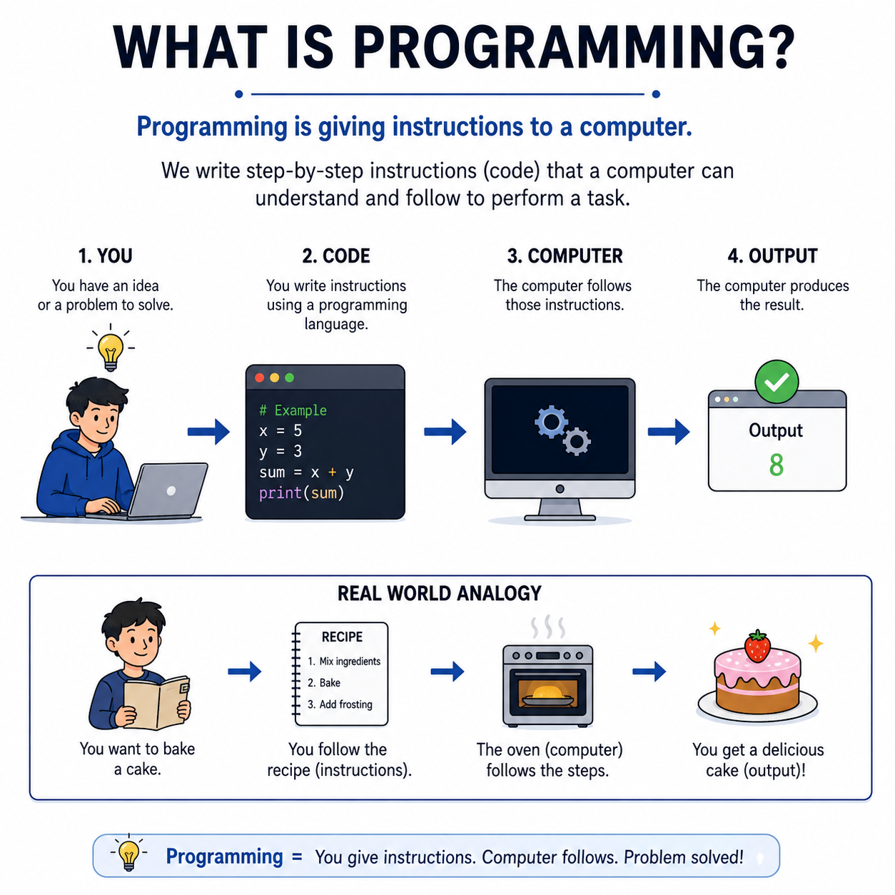
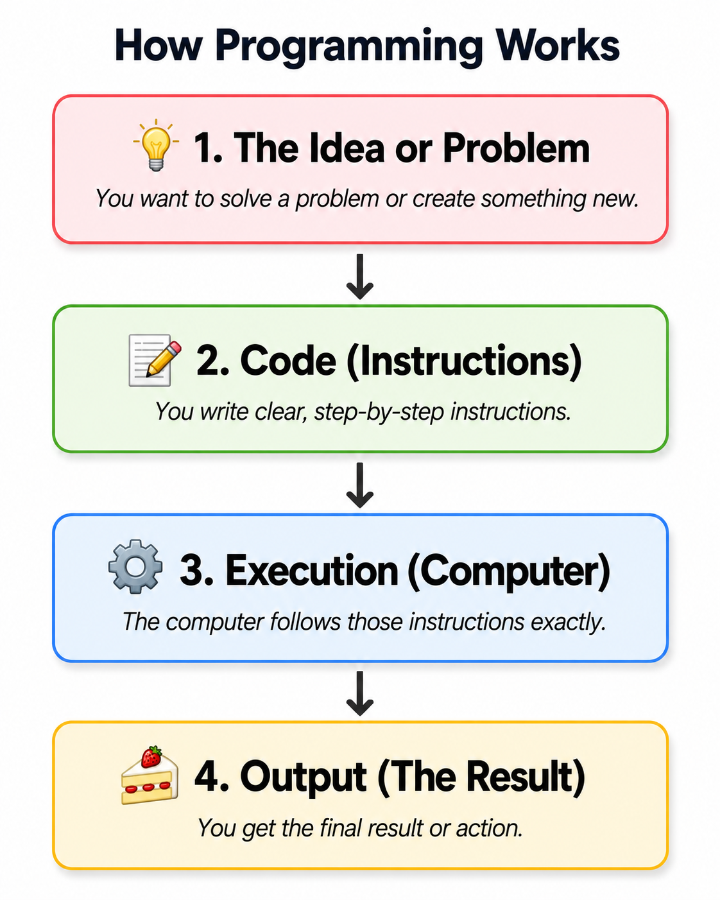

# 🌟 Programming Concepts Visualized

## Level 1: Programming Foundations
### 🔍 Module 1: What is Programming?

> **One concept. One visual. One clear explanation at a time.**

---

---

## 💡 Programming Doesn't Have to Feel Complicated

At its very core, **programming is simply giving instructions to a computer.** 

Before worrying about syntax, programming languages, frameworks, tools, or complex algorithms, beginners need to understand the fundamental mental model. If you build the right foundation, everything else becomes much easier to learn.

---

## 🧠 The Core Mental Model

Every single software application, website, or game follows this exact four-step cycle:

That is the entire foundation!

---

## 🍰 The Cake Analogy

To understand this concept clearly, think of a **recipe**:

*   If you want to bake a cake, you follow a **step-by-step recipe** (instructions).
*   The **oven** processes those steps.
*   At the end, you get a **delicious cake** (the result).

Programming works in the exact same way:

| Component | 🎂 The Recipe Analogy | 💻 Programming Equivalent |
| :--- | :--- | :--- |
| **The Goal** | Bake a chocolate cake | Solve a problem or build a feature |
| **The Instructions** | **The Recipe** | **The Code** |
| **The Processor** | The Baker / The Oven | **The Computer** |
| **The Result** | **A Freshly Baked Cake** | **The Output / Final Product** |

---

## 🎯 Our Philosophy

> [!IMPORTANT]
> The primary goal when learning to program is **not to memorize syntax**. 
> 
> The first and most important goal is to **build the correct mental model**. Once you understand what programming actually represents, learning the syntax of any programming language becomes a natural, straightforward next step.

---

### 🏷️ Series Tags
`#Programming` `#Coding` `#LearnToCode` `#ProgrammingEducation` `#ComputerScience` `#SoftwareDevelopment` `#TeachingProgramming` `#CodingForBeginners` `#ProgrammingConcepts` `#Education`

## 📢 Stay Updated

Be sure to ⭐ this repository to stay updated with new examples and enhancements!

## 📄 License
🔐 This project is protected under the [MIT License](https://mit-license.org/).

## Contact 📧
Panagiotis Moschos - pan.moschos86@gmail.com

---
<h1 align=center>Happy Coding 👨‍💻 </h1>

  Made with ❤️ by 
  <a href="https://www.linkedin.com/in/panagiotis-moschos" target="_blank">
  Panagiotis Moschos</a>

